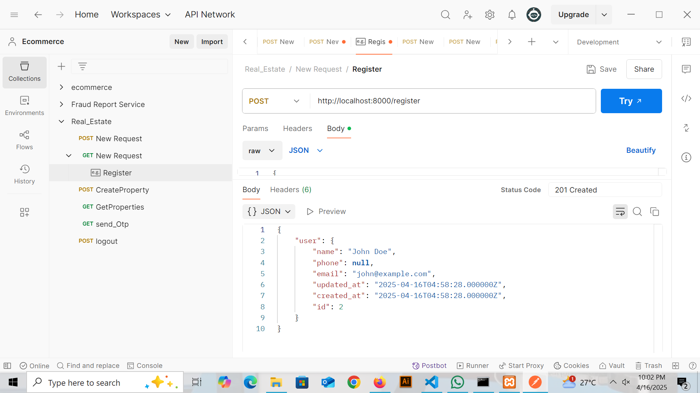

#  Real Estate Marketplace Backend (Sri Lanka)

This is the backend API for the Real Estate Marketplace platform tailored to Sri Lanka. Built with **Laravel**, it supports property listings, requirements, subscriptions, multilingual support, and more.

---
## Tech Stack

- Laravel 10.x
- MySQL
- RESTful API
- Laravel Sanctum (for auth)
- Role-Based Access Control (RBAC)
- Multilingual fields (English & Tamil)

---

##  Key Functionalities

###  User Roles 
- Guest Users
- Registered Users (can post & search)
- Admin (moderation, analytics)

###  Property Listings
- Post property for **Sale** or **Rent**
- Mark as **Owner** or **Agent**
- Upload multiple images
- Free & Premium listing support
- Multilingual Descriptions

###  Search & Filters
- Filter by property type, location, budget, bedrooms, etc.
- Premium listings shown on top

###  Property Requirements
- Buyers/Tenants can post requirements
- Filter requirements using budget, location, etc.

###  Subscriptions
- Free & Premium plans
- Premium = priority listing + more visibility
- Validity-based (monthly/yearly)

###  User Dashboard
- Manage Listings & Requirements
- View stats (Premium only)
- Save Listings & manage Subscriptions

###  Admin Panel
- Moderate listings
- Manage users & subscriptions
- View analytics (listings, leads, locations)

---

## Getting Started (Local Setup)

1. Clone the repository:
```bash
git clone https://github.com/Vishvaparathy/realestate-market-place-project-backend.git
cd realestate-market-place-project-backend

2. Install dependencies:
composer install

3. Copy .env and generate key:
cp .env.example .env
php artisan key:generate

4.Configure database in .env, then run:
php artisan migrate
5.Start the dev server:
php artisan serve


## 📸 Screenshots

###  Realestate Market Place Database


###  User Login & Registration


###  Property Listings 


###  Subscription Plans


###  OTP Request


###  User Roles


###  Registration Testing


###  Login Testing


###  OTP Request Testing


### Create Property Testing


### Property Listing Testing


### Logout Testing

